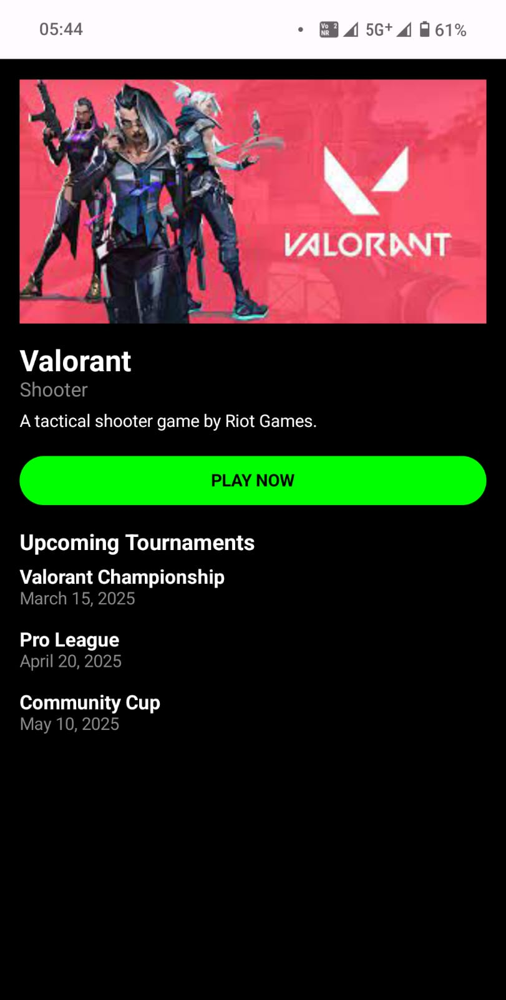

# Gamehok Android Intern Assignment

## 📱 Overview

This is an Android application developed as part of the **Gamehok Android Developer Intern Assignment**. The app is built using **Jetpack Compose (Kotlin)** and follows the **MVVM architecture** for clean and maintainable code. It fetches and displays **games and tournaments** from a mock API and includes a custom-designed **Game Details** screen.

## 🎯 Features

- **Figma Design Implementation:** The app replicates the provided **Figma design** with pixel-perfect UI, maintaining correct spacing, alignment, and typography.
- **API Integration:** Data is fetched using **Retrofit** from mock API endpoints and displayed on respective screens.
- **Game Details Screen:** A custom-designed screen that shows additional information when a user selects a game.
- **Image Loading:** Integrated **Coil** for efficient image loading, with a placeholder for missing images.
- **MVVM Architecture:** The app follows **Model-View-ViewModel (MVVM)** to ensure clean and maintainable code.

## 🚀 Tech Stack

- **Jetpack Compose** - UI framework for modern Android development
- **Kotlin** - Programming language used
- **MVVM Architecture** - Ensures clean and maintainable code
- **Retrofit** - For API calls and network communication
- **Coil** - For image loading and caching

## 🔗 API Endpoints Used

- **Games List:** `GET https://67c9566f0acf98d07089d293.mockapi.io/games`
- **Tournaments List:** `GET https://67c9566f0acf98d07089d293.mockapi.io/tournaments`
- **Tournament Details:** Data extracted from the **tournaments API**, with fallback to dummy data

### 📸 Screenshots

#### Home Screen
| Home Screen 1 | Home Screen 2 |
|--------------|--------------|
|  |  |

#### Tournaments List Screen
| Screen 1 | Screen 2 | Screen 3 |
|---------|---------|---------|
|  |  |  |

| Screen 4 | Screen 5 |
|---------|---------|
|  |  |

#### Game Details Screen
| Game Details |
|-------------|
|  |


## 🛠️ Project Setup

### Prerequisites

- Android Studio (Latest Version)
- Kotlin & Jetpack Compose support
- Internet Connection

### Steps to Run the Project

1. **Clone the repository**
   ```bash
   git clone https:https://github.com/dayam8696/Gamehok-Assignment
   ```
2. **Open in Android Studio** and let Gradle sync.
3. **Run the app** on an emulator or a physical device.

## 📦 APK Download

The APK file can be found [here](https://drive.google.com/file/d/15EBgqBkb9gEfGbSaMsH6qeF0LKGKOkO3/view?usp=sharing).

## 📩 Contact

For any queries or discussions, feel free to reach out! 😊

**Email:** [your.email@example.com](mailto\:your.email@example.com)\
**GitHub:** [yourgithub](https://github.com/yourusername)

 

